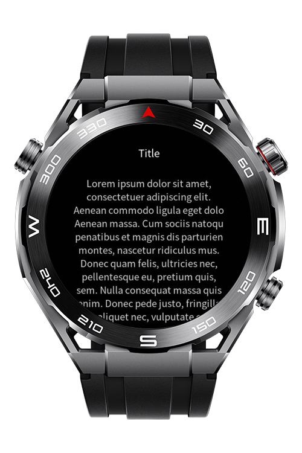
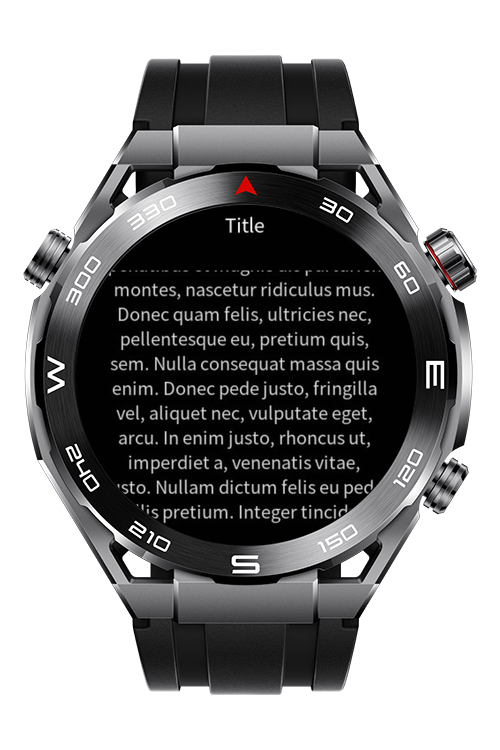

> **Note:** To access all shared projects, get information about environment setup, and view other guides, please visit [Explore-In-HMOS-Wearable Index](https://github.com/Explore-In-HMOS-Wearable/hmos-index).

# How to Build Scrollable Dynamic Text

This project demonstrates a simple scrollable text with dynamic height. If a text appears with a dynamic length, the code parses the related text into chunks word-by-word according to the device width and font size. Chunked text will be printed line by line into a list to get a stable view.

# Preview

<div>
    
    
</div> 

# Use Cases

Handle Texts from APIs: Since texts coming from APIs are not static texts, this codelab can be used to solve that problem.

Display Long Texts for Different Devices: Different watches have different width values, so giving a static height inside the css file may broke the UI. This codelab provides a dynamic solution. 

# Tech Stack

- **Languages**: JavaScript
- **Frameworks**: HarmonyOS SDK 6.1.1(24)
- **Tools**: DevEco Studio Vers 6.1.1.280

# Directory Structure
   ```
   src/main/js/MainAbility/pages/
   |---index
   |   |---index.css                     // App CSS File
   |   |---index.hml                     // App HML File
   |   |---index.js                      // App Home Page
   ```

# Constraints and Restrictions
## Supported Devices
- Huawei Lite Wearable Devices

# License
**How to Build Scrollable Dynamic Text** is distributed under the terms of the MIT License
See the [LICENSE](./LICENSE) for more information.